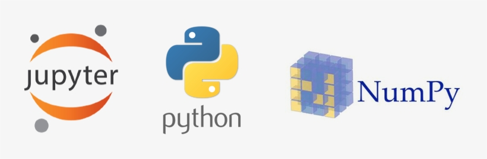

# Story 4 - Mise en place du poste de travail

[Source de l'image](https://www.seekpng.com/ipng/u2q8r5r5a9q8o0e6_jupyter-python-and-numpy-logos-python-jupyter-logo/)

## Sommaire
1. [Contexte](#contexte)
2. [Mots-clés](#mots-clés)
3. [Problématique](#problématiques)
4. [Hypothèses](#hypothèses-vrai-faux)
5. [Tableau avantage python](#tableau-avantages-inconvénients-python)
6. [Tableau avantage Anaconda](#tableaux-avantages-inconvénients-anaconda)
7. [Tableau avantage Jupyter](#tableau-avantages-inconvénients-jupyter)

## Contexte : 

Pour développer une IA et pour la collaboration il faut utiliser différents outils informatiques qui faut installer sur son poste de travail :  Jupyter, python, Anaconda, etc.

## Mots-clés : 

- **Jupyter notebook** : Environnement de calcul basé sur le web.

- **GitHub** : Plateforme collaborative pour stocker, versionner et consulter du code. Il y a aussi un forum, un système de demande de fonctionnalité / de problème rencontré dans un projet, etc.

- **Collaboration** :  Action par laquelle deux ou plusieurs personnes travaillent ensemble pour atteindre un but commun.

- **Interpréteur** : L'interpréteur analyse, traduit et exécute les instructions écrit dans un langage interprété (comme Python).

- **Compilateur** :  Le compilateur est un traducteur d'un langage source (écrit en langage compilé) à un langage objet (ou bas nivea)

- **Librairie ou bibliothèque** :  Une librairie est un ou plusieurs fichiers dont l'objectif est d'utiliser du code déjà développé. Certains projets ont besoin de libraires spécifique pour fonctionner, on peut les appeler dans ce contexte des dépendances.

- **Python** : Python est un langage de programmation de haut niveau, interprété et orienté objet. C'est le langage préféré des développeurs IA et de la Datascience

- **Anaconda** : Gestionnaire de librairie axé sur l'intelligence artificielle

- **Vs code** :  VSCode est un IDE

- **Terminal** : Programme qui sert d'interface entre l'utilisateur et le système

- **Environnement** :  L'endroit dans lequel on développe. L'environnement

- **Matplotlib** :  bibliothèque du langage de programmation Python destinée à tracer et visualiser des données sous forme de graphiques. Elle peut être combinée avec les bibliothèques python de calcul scientifique NumPy et SciPy.

- **Numpy** :  NumPy est une bibliothèque pour langage de programmation Python, destinée à manipuler des matrices ou tableaux multidimensionnels ainsi que des fonctions mathématiques opérant sur ces tableaux.

- **Pandas** : Pandas est une librairie écrite pour Python permettant la manipulation et l'analyse des données. Elle propose en particulier des structures de données et des opérations de manipulation de tableaux numériques et de séries temporelles.

- **Scipy**:  SciPy est une collection d'algorithmes mathématiques et de fonctions pratiques construite sur la base de NumPy.

- **IDE** :  Environnement de Développement intégré. Inclut généralement un éditeur de texte, des outils de construction automatique, un débogueur et parfois un compilateur ou un interpréteur.

- **Collab** :  Jupyter Notebook de Google

## Problématique(s) : 

**Comment choisir les outils de travail et les installer ?**  

## Hypothèses Vrai-Faux :  

- Patrick : on peut développer une intelligence artificielle sans utiliser python | Vrai

- Hadjer : Github est necessaire pour développer une application IA | Faux

- Salah : les outils proposer sont-ils suffisants pour développer une IA | Vrai / Faux

- Rafael : Python est un langage interpréter | Vrai

- Thibaut : On peut utiliser plusieurs librairies au même temps pour obtenir un résultat  | Vrai

- Alexis : anaconda est une version plus puissante que python | Faux

- Hassan : les librairies ne sont pas essentielles pour la création d’une ia  | Vrai

- Alexandre : les compilateurs prennent plus de temps que les interpréteurs  | Faux

- Ahmed : Jupyter est un langage de programmation pour l’IA  | Faux

- Munkherdene : une base de données est obligatoire pour la création d’une IA  | Vrai

    -  Python est le plus utiliser que les autres langages car c’est là ou y a le plus de librairie | Vrai / Faux

- Philippe : Tous les IDE ont la même efficacité quelques soit le langage | Vrai / Faux

- Bart : Anaconda c’est un gestionnaire de librairie | Vrai

- Paul : les librairies python sont payantes | Faux

## Tableaux avantages inconvénients Anaconda

| Avantages                                  | Inconvénients                              |
| ------------------------------------------ | ------------------------------------------ |
| Gestion simplifiée des environnements      | Volumineux sur le disque |
| Conda facilite la gestion des dépendances  | Peut être plus lent que d'autres outils   |
| Large choix de packages pour l'IA/ML   | Courbe d'apprentissage pour les débutants |
| Installation de packages hors Python       | Conflits potentiels entre packages        |
| Interface graphique avec Anaconda Navigator| Dépendant de l'écosystème Conda           |
| Intégration avec des outils de développement| Peut être surdimensionné pour de petits projets|
| Compatibilité multiplateforme (Windows, macOS, Linux) | |
| Isolation des projets pour éviter les conflits|                                          |
| Facilite la reproduction des environnements |                                          |

## Tableau avantages inconvénients Python

| Avantages                | Inconvénients                                   |
|:------------------------ |:----------------------------------------------- |
| Vaste choix de librairie | Les librairies qui peuvent créer une dépendance |
| Open Source + communauté | La simplicité du langage fait qu'il n'est peut être pas                                                |
| Multiparadigme           | Sa vitesse (Interprété + type dynamique = plus lent). Mais bibliothèques comme NumPy ou Pandas permettent e'effectuer des opérations mathématique à très grande vitesse)                                               | 
| Simple à apprendre (syntax)                         | Gourmand en mémoire (à cause du typage dynamique)                                                |

[Source](https://hdfever.fr/avantages-inconvenients-python)

## Tableau avantages inconvénients Jupyter

| Avantages                                             | Inconvénients                                         |
|-------------------------------------------------------|-------------------------------------------------------|
| Outil open source, gratuit                            | Notebooks ne sont pas indépendants                    |
| Compatible avec de nombreux langages de programmation | Difficile de sauvegarder l’état d’une session         |
| Peut être exécuté depuis une machine locale ou serveur|                                                       |
| Représentation au format JSON                         |                                                       |
| Convertible en différents formats (Markdown, HTML, PDF)|                                                      |
| Facile à partager via des plateformes comme GitHub    |                                                       |
| Contribue à la démocratisation de la Data Science     |                                                       |

[Source](https://www.lebigdata.fr/jupyter-notebook)

## Plan d’action : 

Explore les ressources 

Définir les mots clés 

Installation d’anaconda 

Création du compte Github 

Faire 3 tableaux avantages inconvenants : anaconda, jupyter notebook et python  

Vérification des hypothèses  

Finaliser le RER